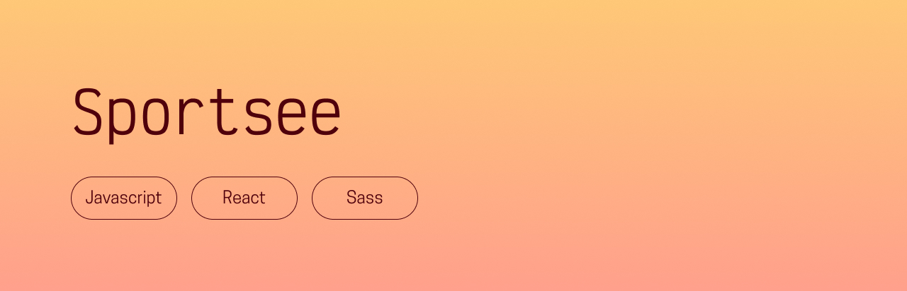

## Presentation
*This is a fictional project, which was project 12 of my OpenClassrooms front-end development program.* \
SportSee is a dashboard prototype for tracking a user's workout stats (weight, calorie intake, performance...).

## Prerequisites
- [NodeJS (version 16.17.0)](https://nodejs.org/en/)
- [NPM (version 9.4.0)](https://www.npmjs.com/)
- [React (version 18.2.0)](https://en.reactjs.org/)

## Installing the app

### Back-end
This repository is the front-end part of Sportsee. The back-end is in this repository: https://github.com/OpenClassrooms-Student-Center/P9-front-end-dashboard.git – you first need to follow their instructions to install it.

### Front-end
Once the back-end is installed:
- Fork and clone this repository
- Run `$ npm install` to install all dependencies

## Running the app
So all links work, you should start the back-end first, so it runs on localhost:3000 and the front-end runs on localhost:3001. To do so:

### Back-end
- Move to the root of the back-end repository on your machine
- Run `$ npm run dev`

### Front-end
Once the back-end is running on port 3000:
- Open a new terminal
- Move to the root of the front-end repository on your machine
- Run `$ npm start`
- You should get a message warning you that something's already running on port 3000, and asking if you want to run this on another port: say yes!

## Thanks for reading, and happy coding!  
Chloé Adrian
